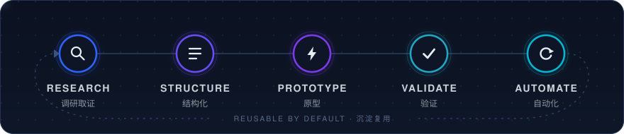

  

I turn ambiguous business problems into **verifiable AI workflows, local-first tools, and reusable agent skills**.

用人的判断定义问题，用一队 AI 放大执行，把结果沉淀为产品、Skill 与可重跑流程。

  
  
  
  

## Flagship Projects

  
  

## Selected Builds

- **[AI Chain Quant Global](https://github.com/evans777max/ai-chain-quant-global)** — A local cross-market AI-sector research terminal that turns market data, factor rules, and risk boundaries into an explainable workflow.
- **[Soul Blade Plus](https://github.com/evans777max/soul-blade-plus)** — A single-file 2D fighting game built on Canvas and Web Audio, with pixel-art rendering and automated browser verification. [Play it live](https://evans777max.github.io/soul-blade-plus/).
- **[Resume Now](https://evans-career.netlify.app)** — A career portfolio system combining interconnected pages, automation records, contextual AI guidance, and visual experiments.

## How I Work

  

- **Evidence first** — conclusions should be traceable; uncertainty should be visible
- **Local first** — reduce deployment and environment friction wherever practical
- **Reusable by default** — turn one-off work into structures, scripts, SOPs, or skills
- **Human judgment, agent execution** — people define the problem and boundaries; agents amplify delivery
- **Validation before release** — automated checks, browser tests, and explicit review gates

## Background

- 5+ years in cross-border logistics and business operations
- Experience across large-scale fulfillment and international delivery scenarios
- MBA candidate, Class of 2027
- Exploring how AI changes business workflows, product delivery, and individual leverage

  

## Contact

  
  
  

