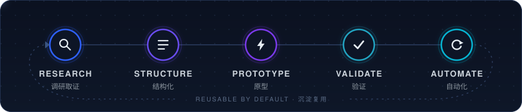

  

**用业务判断定义问题，用一队 AI 放大执行，把结果沉淀为可复用的产品、规则与流程。**

我的工作方式是：把模糊的业务问题收敛成可验证的规则与方案，用 AI 跑通实现，再按真实反馈迭代——判断由人来做，执行交给 Agent 放大。

  
  
  
  

## 代表项目

  
  

**[指北 TrueNorth](https://github.com/evans777max/TrueNorth)** — 把每天扑面而来的 AI 信息，整理成能直接上手的工作打法。单文件、离线、自包含的 AI 工作导航站，45 条全复核 Skill ＋ 37 套带解读的方案，每条结论都能追溯到来源。[在线体验](https://true-north-ev.netlify.app)

**[dev-skills](https://github.com/evans777max/dev-skills)** — 教 AI Agent 什么叫「交付得漂亮」。把设计语言、工程纪律与反模式写成 Agent 能读的规则，零框架依赖，让每次生成从「能跑」直接到「像设计过的」。

## 我怎么工作

  

- **先定规则，再谈实现** — 模糊需求先收敛成输入、字段、规则、输出与复核责任，然后才动手
- **证据可追溯** — 结论要能回溯到来源，不确定性要显式标注，不藏在结论里
- **判断留给人，执行交给 Agent** — 高频、重复、规则明确的环节先自动化；判断类环节保留人工复核
- **一次性工作变成可复用结构** — 把做过的事沉淀为规则、脚本、SOP 或 Skill
- **发布前必须验证** — 自动化检查、浏览器实测、明确的评审关卡

## 背景

- 近 5 年跨境电商与供应链经验，横跨商家侧与平台侧
- 现在亚马逊全球物流（AGL）销售智能与业务拓展部：品类情报产品 0→1、AI 工作流落地、GTM 赋能
- 此前在 JDI Ventures 从 0 到 1 搭建跨境物流职能，统筹 50 万+ 件欧美履约；在韵达供应链作为大区 BDM 完成 10+ 个 B 端商家项目从开发到上线
- 上海交通大学安泰经管学院 工商管理硕士（2027 届）
- 关注 AI 如何改变业务流程、产品交付方式与个人杠杆

  

## 联系

  
  

